## 面向对象的分析与设计 个人作业报告

- 目标模型 ：Modelica-ML

  ​		Modelica-ML是一种统一的面向对象的物理系统建模语言，能够对多领域的复杂物理系统进行建模。Modelica的非因果建模，使得 Modelica 模型能够被重用，实现对复杂物理系统的层次化建模，能
  够有效提高平台的建模能力。 

  ​		与其他建模工具或面向对象语言不同的是，Modelica使用方程描述系统行为，方程不具有方向性，不指定输入或输出（即所谓的非因果建模），建模后系统将对应一个微分代数方程组，并通过Modelica翻译器翻译为C语言程序，最终生成可执行程序。

  ​		Modelica中的基本建模单元是model，model间可以是继承关系，也可以是组合关系；每个模型内部包含接口、方程和变量，共同决定了的模型内部的行为。不同模型的可以通过接口的链接构造一些特殊方程，表达了不同模型间物理量的相互影响关系。

  ​		例如，一个电阻可能被类似如下的Modelica代码描述：

  ```python
  model Resistor  
    parameter Resistance R; 
    Pin p; 
    Pin n;  
  equation 
    p.v - n.v = v;  
    v = R * i; 
  end Resistor; 
  ```

  ​		这里方程描述了接口p,n上电压与电阻、电流的关系。如果要表达电阻、电源构成的整体，其Modelica代码可能类似：

  ```python
  model Circuit 
    ConstantVoltage E; 
    Ground ground; 
    Resistor R; 
  equation 
    connect(E.n, R.n); 
    connect(R.n, ground.p); 
    connect(ground.p, E.p);
  end Circuit
  ```

- 目标模型元模型

  ​		分析Modelica语言的特点，可知：

  - ModelicaModel是元模型的根节点

  - ModelicaModel间的关系可以是继承、组合

  - ModelicaModel包含了参数（即变量）

  - ModelicaModel包含了接口

  - ModelicaModel包含了约束，可能由方程（等式）表述，也可能由连接(connect)表述

  - 参数具备量纲和值类型

  - 方程由参数表达

  - 接口绑定了某些参数

  - 连接发生在接口之间

  - ...

    根据以上特点，可以画出Modelica-ML的元模型。

    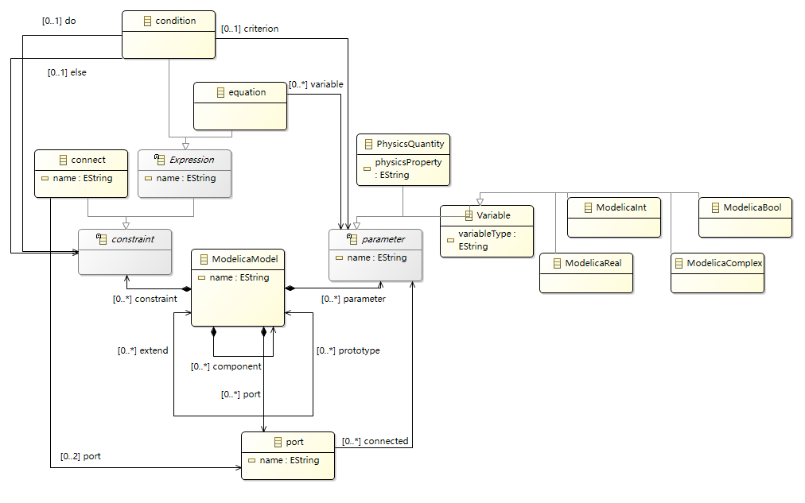

    Modelica中还可以构造条件分支，根据变量的取值控制约束（方程或连接）的生效。这一点也体现在元模型中。

- 使用Sirius为元模型配置图符、制作workbench：

  节点：

  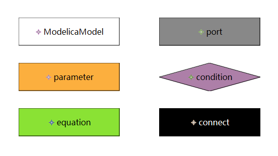

  节点间的连接：

  ​	*模型到变量*

  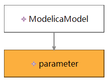

  ​	*方程到变量*

  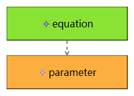

  ​	*模型到方程*

  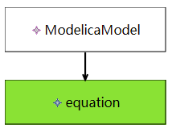

  ​	*模型到端口*

  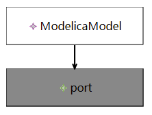

  ​	*端口到变量*

  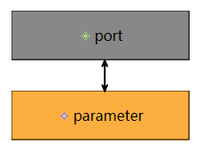

  ​	*端口的连接*

  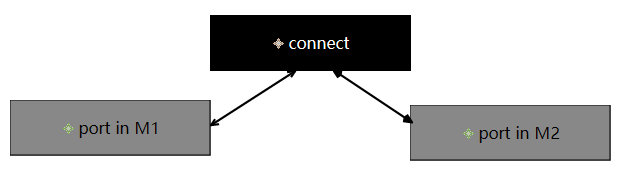

  ​	*模型内的条件控制*

  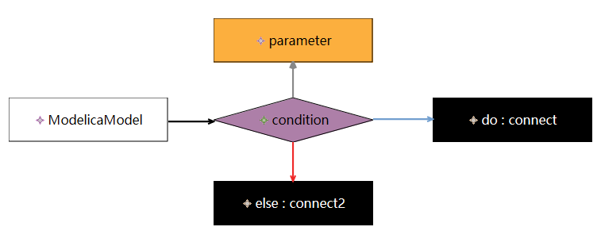

  ​	*配置的模型图符、建模工具*

  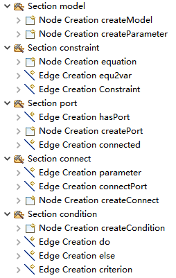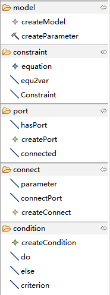

  视频及相关文件见：

  https://github.com/wongdark2017/bitcoinEHR/tree/main/sy2130105%E6%AF%9B%E4%BB%81%E5%87%A1-%E5%88%B6%E4%BD%9Cworkbench

- 模型转换

  ​		输出端元模型如图：

  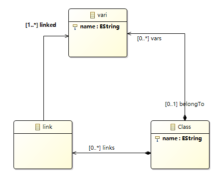

  ​		在输入端元模型中，变量链接到端口，端口再连接，来表达不同模型中变量的关系。在输出端元模型中，变量的连接通过link直接联系起来。

  ​		新元模型中的Class与ModelicaModel对应，vari与parameter对应。

  ```python
  rule model2class {
  	from
  		s: metaModelicaML!ModelicaModel
  	to
  		t: TargetModel!Class (
  			name <- s.name,
  			
  			vars <- s.parameter->
  				collect(var | thisModule.para2val(var)),
  				
  			links <- s.constraint->
  			select(c | c.oclIsTypeOf(metaModelicaML!connect))
  				->collect(c | thisModule.con2lik(c))
  		)
  }
  ```

  ​		这里将每个ModelicaModel映射到新元模型中的Class，并且获取相同的名称。ModelicaModel包含的参数将被全部转化为vari，包含的connect将被转化为link。

  

  ```python
  lazy rule para2val {
  	from
  		s: metaModelicaML!parameter
  	to
  		t: TargetModel!vari (
  			name <- s.name,
  			
  			belongTo <- metaModelicaML!ModelicaModel.allInstances()
  				->select(m | m.parameter -> exists(p | p=s))
  		)
  }
  ```

  ​		para2val被model2class调用，将parameter映射到新元模型中的vari，并获取相同的名称。并从ModelicaModel中找到参数中包含自己的那一个作为belongTo。

  

  ```
  lazy rule con2lik {
  	from
  		s: metaModelicaML!connect
  	to
  		t: TargetModel!link (
  			linked <- s.port ->collect(p | p.connected ->collect(v | thisModule.para2val(v)))
  		)
  }
  ```

  ​		con2lik被model2class调用，将connect映射到新元模型中的link，从connect的port中找到其所链接的变量，并作为这个link所连接的linked : vari集合。

  

  输入端模型：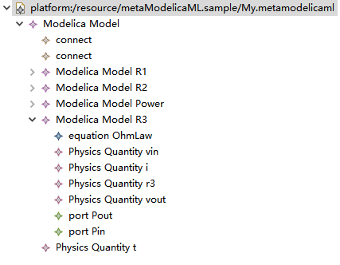；输出端模型：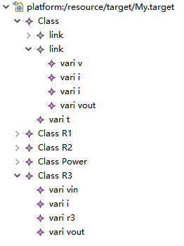

  可以看到转出的模型中不再含有port，connect直接链接到对应的变量。

  相关文件和视频见github

